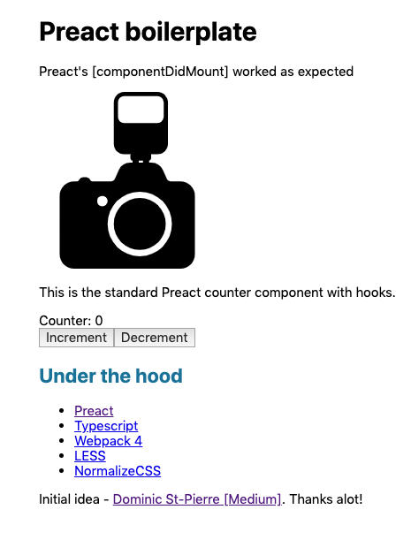

# Preact + Typescript + Webpack 5 + LESS + Docker / boilerplate

Preact v10.0 with hooks demo

## Things under the hood:

* [Preact](https://preactjs.com/)
* [Typescript](https://www.typescriptlang.org/)
* [Webpack 5](https://webpack.js.org/)
* [LESS](http://lesscss.org/)
* [Docker](https://www.docker.com/)

Initial idea [Dominic St-Pierre](https://dominicstpierre.com/how-to-start-with-typescript-and-preact-a9ea3e0ba4dc)

I've tried to keep things as simple as possible.

## Changelog

[16-March-2021] 
- Webpack and dependencies were upgraded to version 5
- Typescript 4
- LESS 4
- TSLint replaced with ESLint
- Syntax aligned with ESLint rules
- Docker and docker-compose build modes were added

## Installation

1. Clone repository.
2. Run 'npm install' in the local copy (I hope you have NodeJS and NPM installed =)
3. Use one of:
    * `npm run build` for production build
    * `npm run dev` for development build (no minification)
    * `npm run start` for live server on `http://localhost:3030/`

Also, Windows shortcuts are here. See `*.bat` files.

## Screenshot

## Docker

### Quick start

You can just run `docker_build.cmd` script.

Before run please remove `dist` folder, if any.

## Modes

### Production mode (build `dist` folder and exit)

In root folder run `docker-compose up` to build the files. Result will be
placed into `dist` folder. Stop the container afterwards.

#### Development + watch mode (build and watch changes)

In root folder run `docker-compose -f docker-compose.watch.yml up` to build the files. Result will be placed into `dist` folder and Webpack will start watching.

`node_modules` and `dist` folders will be mapped.

#### Development + devserver mode (build and run development server)

In root folder run `docker-compose -f docker-compose.start.yml up` to build the files. Result will be placed into `dist` folder and application will start watching. Webserver will be available on URL `localhost:3030`.

`node_modules` and `dist` folders will be mapped.

## Credits

[photo-camera-with-a-flash](https://www.svgrepo.com/svg/5111/photo-camera-with-a-flash)
